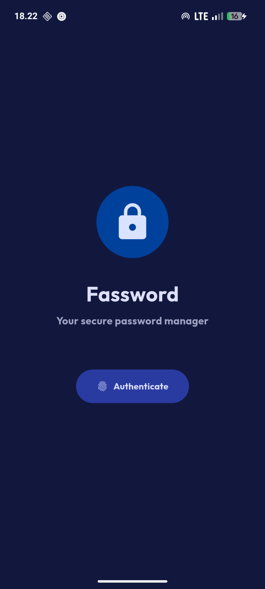
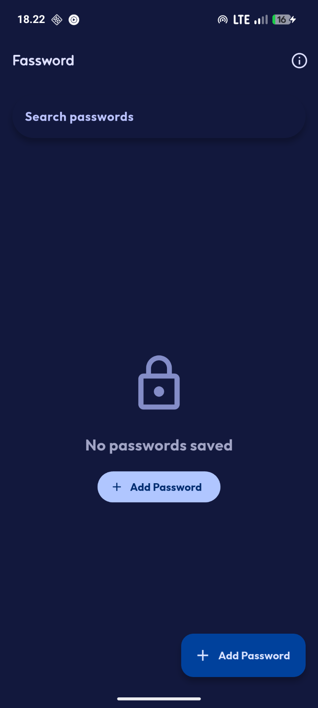
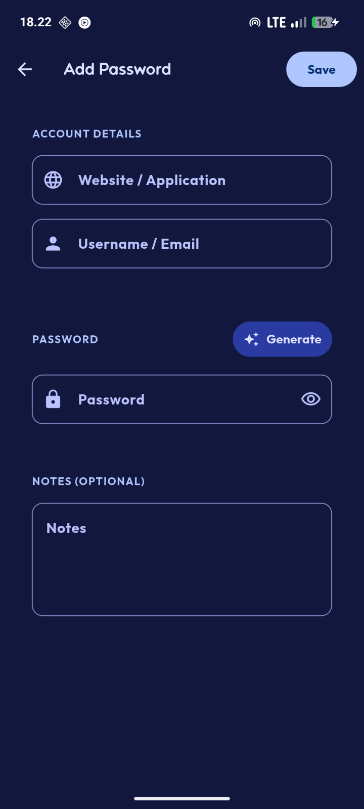

[](https://github.com/felle-dev/fassword-app/releases)
[](https://flutter.dev)
[](LICENSE)

**[Fassword](https://github.com/felle-dev/fassword-app)** is a simple, intuitive password manager app built with Flutter. Securely store, manage, and access your passwords with ease.

[](https://github.com/felle-dev/fassword-app/releases)

## **Features**

- **Password Management** – Create, edit, and delete passwords securely
- **User-Friendly Interface** – Intuitive design for easy navigation
- **Privacy-First** – Your data stays on your device

## **Screenshots**

<div style="display: flex; justify-content: space-around; gap: 10px;">
  
  
  
</div>

## **Tech Stack**

- **Language:** Dart
- **Framework:** Flutter
- **UI:** Material Design 3

## **Getting Started**

### **Prerequisites**
- [Flutter SDK](https://flutter.dev/docs/get-started/install) (latest stable version)
- Android Studio / VS Code with Flutter extensions
- Android device or emulator (API 24+)

### **Installation**
1. Clone the repository:
   ```bash
   git clone https://github.com/felle-dev/fassword-app.git
   cd fassword-app
   ```
2. Install dependencies:
   ```bash
   flutter pub get
   ```
3. Run the app:
   ```bash
   flutter run
   ```

## **Contributing**
Contributions are what make the open-source community thrive! Feel free to:
- Fork the project
- Open issues for bugs or feature requests
- Submit pull requests with improvements

## **License**
This project is licensed under the **GNU General Public License v3.0**. See the [LICENSE](LICENSE) file for more details.

[release-badge]: https://img.shields.io/github/v/release/felle-dev/fassword-app?style=for-the-badge
[flutter-badge]: https://img.shields.io/badge/Flutter-02569B?style=for-the-badge&logo=flutter&logoColor=white
[license-badge]: https://img.shields.io/github/license/felle-dev/fassword-app?style=for-the-badge
